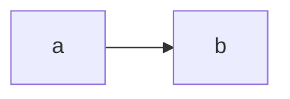
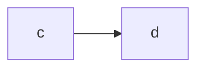
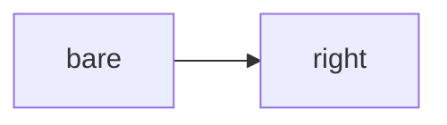
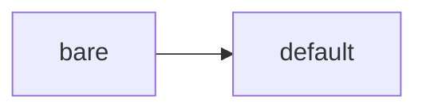
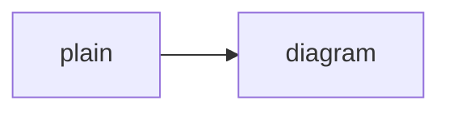

```mermaid
%%| label: fig-right
%%| fig-cap: A numbered float, aligned right.
%%| fig-align: right
flowchart LR
  a --> b
```

```mermaid
%%| fig-cap: An unnumbered figure, aligned left.
%%| fig-align: left
flowchart LR
  c --> d
```

```mermaid
%%| fig-align: right
flowchart LR
  bare --> right
```

```mermaid
%%| fig-align: default
flowchart LR
  bare --> default
```

```mermaid
flowchart LR
  plain --> diagram
```
